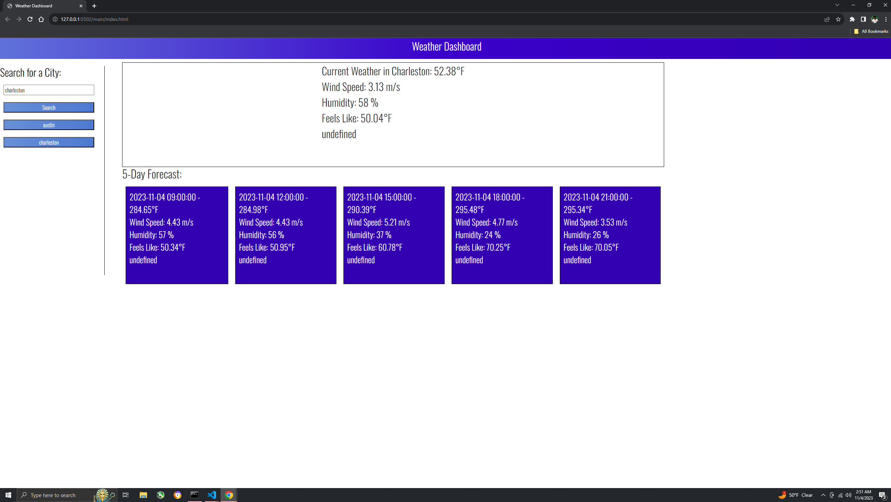

# weatherDashboard

## Description

This project allows you to type in the input field any city you would like and it will give you the current weather and also the forecast for it. It will than save your previous search and you will be able to click the city in your previous searches and it will repopulate. The app is using OpenWeather API.

## Table of Content 

- [Instalalation](#installation)
- [usage](#usage)
- [Credits](#credits)
- [Liccense](#license) -- https://opensource.org/license/MIT

## Installation 

## Usage

to access this website you will click the link in github or type in the url address ""

## Credits

Upenn

Dru Sanchez during tutoring sessions

https://openweathermap.org/api

## License

MIT License

Copyright (c) 2023 Barkley

Permission is hereby granted, free of charge, to any person obtaining a copy
of this software and associated documentation files (the "Software"), to deal
in the Software without restriction, including without limitation the rights
to use, copy, modify, merge, publish, distribute, sublicense, and/or sell
copies of the Software, and to permit persons to whom the Software is
furnished to do so, subject to the following conditions:

The above copyright notice and this permission notice shall be included in all
copies or substantial portions of the Software.

THE SOFTWARE IS PROVIDED "AS IS", WITHOUT WARRANTY OF ANY KIND, EXPRESS OR
IMPLIED, INCLUDING BUT NOT LIMITED TO THE WARRANTIES OF MERCHANTABILITY,
FITNESS FOR A PARTICULAR PURPOSE AND NONINFRINGEMENT. IN NO EVENT SHALL THE
AUTHORS OR COPYRIGHT HOLDERS BE LIABLE FOR ANY CLAIM, DAMAGES OR OTHER
LIABILITY, WHETHER IN AN ACTION OF CONTRACT, TORT OR OTHERWISE, ARISING FROM,
OUT OF OR IN CONNECTION WITH THE SOFTWARE OR THE USE OR OTHER DEALINGS IN THE
SOFTWARE.